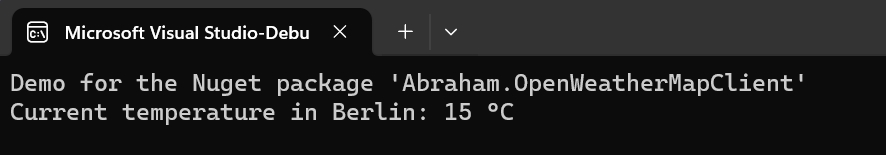

# Abraham.OpenWeatherMapClient

## OVERVIEW

Gets the current weather and forecast from openweathermap.org Web API.
You can use it for free, if you register and get an API key.


## License

Licensed under Apache licence.
https://www.apache.org/licenses/LICENSE-2.0


## Compatibility

The nuget package was build with DotNET 6.


## INSTALLATION

Install the Nuget package "Abraham.OpenWeatherMapClient" into your application (from https://www.nuget.org).

Add the following code:
```C#
    var client = new OpenWeatherMapConnector()
        .UseApiKey(_myApiKey)
        .UseLocation(lattitude:"53.8667", longitude:"9.8833");

    var weatherInfo = client.ReadCurrentTemperatureAndForecast();

    Console.WriteLine($"Current temperature: {weatherInfo.CurrentTemperature} {weatherInfo.Unit}");
```


That's it!

For more options, please refer to my Demo application in the github repository (see below).
The Demo and the nuget source code is well documented.


## WHAT IS AN API KEY?
When you register at OpenWeathermap.org, you will get an API key.
That is a long number, similiar to a password.
It's your personal key to access the OpenWeatherMap Web API.


## HOW TO INSTALL A NUGET PACKAGE
This is very simple:
- Start Visual Studio (with NuGet installed) 
- Right-click on your project's References and choose "Manage NuGet Packages..."
- Choose Online category from the left
- Enter the name of the nuget package to the top right search and hit enter
- Choose your package from search results and hit install
- Done!


or from NuGet Command-Line:

    Install-Package Abraham.OpenWeatherMapClient


## HOW TO FIND OUT THE LATITUDE AND LONGITUDE OF A CITY
The API needs these two values. You can find them on Google Maps.

You can use Google Maps to find out the latitude and longitude of a city. Here are the steps:
1.	Go to Google Maps (https://www.google.com/maps)
2.	Type in the name of the city you want to find the latitude and longitude for in the search bar.
3.	Right-click on the location on the map and select "What's here?" from the context menu.
4.	The latitude and longitude will be displayed in the popup or in the search bar.


## AUTHOR

Oliver Abraham, mail@oliver-abraham.de, https://www.oliver-abraham.de

Please feel free to comment and suggest improvements!


## SOURCE CODE

The source code is hosted at:

https://github.com/OliverAbraham/Abraham.OpenWeatherMapClient

The Nuget Package is hosted at: 

https://www.nuget.org/packages/Abraham.OpenWeatherMapClient


## SCREENSHOTS

This shows the demo app getting the current temperature:



# MAKE A DONATION !

If you find this application useful, buy me a coffee!
I would appreciate a small donation on https://www.buymeacoffee.com/oliverabraham
